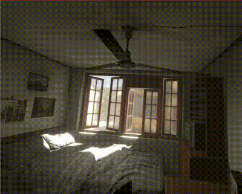

# Panorama180Movement Demo

[English readme](./README.md)

## はじめに

VR180などの180度パノラマ-3D画像を使用した場合、VR上ではカメラを中心に向きを変えることができますが移動することはできません。    
3DoFの動作となります。    
このパノラマ画像を使用したVR空間上で特定の方向に移動できるようにし、
また、極力負荷をかけない計算を行い、制限付きの6DoF操作ができるようにします。    

     

## 開発環境

Unity 2018.3.8 (Windows)     

## 使い方

[Panorama180Movement]フォルダをUnityで開き、Scenes/SampleSceneのシーンを開きます。    
Main Cameraにあらかじめリソースとして格納してある「空間キャッシュ」（RGBテクスチャ、Depthテクスチャ、移動座標、Y回転値など）の情報を指定します。    
なお、リソースの読み込みなどの実装はハードコーディングされています。    
これはあくまでもデモとしてご使用くださいませ。    

実行は、Oculus Riftをかぶって確認しました。    

## 実行ファイル

以下より実行ファイルをダウンロードできます。    

https://ft-lab.jp/VRTest/index_jp.html

## アルゴリズム解説

以下で、本デモのアルゴリズムを記述しています。    

https://ft-lab.jp/VRTest/algorithm_jp.html

## 更新履歴

### [04/30/2019]

- README更新。英語のREADME追加。

### [04/29/2019]

- GitHubにソースコードをアップロード

### [04/23/2019] ver.1.0.1 

- 内部的なリソースを最適化（容量削減）
- 空間補間処理の最適化

### [04/14/2019] ver.1.0.0

- はじめのリリース
